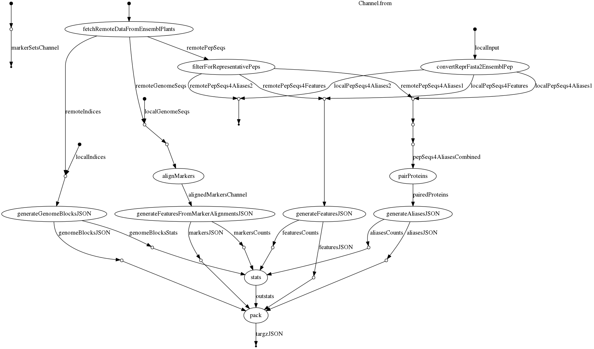
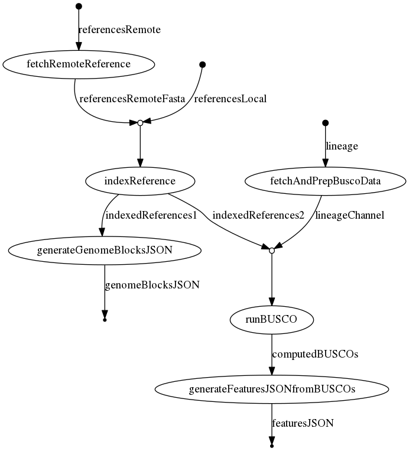

[](https://github.com/plantinformatics/pretzel-input-generator/releases)

[](https://github.com/plantinformatics/pretzel-input-generator/releases)

[](https://github.com/plantinformatics/pretzel-input-generator/actions)


- [Pipeline overview](#pipeline-overview)
- [Default pipeline](#default-pipeline)
  - [Quick start example using microsporidia data](#quick-start-example-using-microsporidia-data)
  - [Input specification (triticeae and other relevant data sets)](#input-specification-triticeae-and-other-relevant-data-sets)
    - [Disparate triticeae datasets](#disparate-triticeae-datasets)
  - [Dependencies](#dependencies)
  - [Execution](#execution)
  - [Output](#output)
- [BUSCO-based pipeline](#busco-based-pipeline)
  - [Quick-ish start](#quick-ish-start)
  - [Output](#output-1)


# Pipeline overview

`pretzel-input-generator` is a [nextflow](https://www.nextflow.io) pipeline for generating input for [pretzel](https://github.com/plantinformatics/pretzel) from annotated and (mostly) contiguous genome assemblies. The pipeline requires approximately ??? cpu-???, but as many processes can run independently, the real run-time is much shorter if suitable compute resources are available.


<!-- TODO: re-generate TOC -->

# Default pipeline

Designed for EnsemblPlants and similarly formatted data.




## Quick start example using microsporidia data


Requires [nextflow](https://www.nextflow.io) and either [Singularity](http://singularity.lbl.gov)

```
nextflow run plantinformatics/pretzel-input-generator \
-profile MICROSPORIDIA,singularity --max_cpus 2 --max_memory 2.GB 
```

This will pull and process data sets specified in [`conf/microsporidia.config`](conf/microsporidia.config)


## Input specification (triticeae and other relevant data sets)

A mix of local and remote files can be specified - see [`conf/microsporidia.config`](conf/microsporidia.config) and the corresponding [`conf/test-data.config`](conf/test-data.config)

There are several paths through the pipeline which are executed depending on input specification and availability of various input file types, e.g. 

* genome assembly index file 
* protein sequences (required if pipeline is to generate aliases)
* marker sequences
* genome assembly fasta (required if pipeline is to place marker sequences on assemblies)

Different paths through the pipeline rely on partly different inputs

1. Generation of genome blocks requires a genome assembly index file - all we really need are lengths of pseudo-chromosomes so a two-column `.tsv` file with chromosome names and their lengths will suffice. Also, if genome assembly fasta file is specified, the index will be generated automatically.

2. Placement of gene features on the generated genome blocks and generation of aliases between features requires

  * gene annotations (either GTF or GFF3)
  * matching protein sequences (presumably for representative isoform)

If GTF/GFF3 is not available, the protein sequences FASTA id and description lines must be formatted to contain information as per the following example:

```
>AT1G24405.1 pep chromosome:TAIR10:1:8654945:8655662:1 gene:AT1G24405
```

This follows how protein sequences are annotated on Ensembl plants, but we do not **currently** use all the information in the description line, the complete version of which is:

```
>AT1G24405.1 pep chromosome:TAIR10:1:8654945:8655662:1 gene:AT1G24405 transcript:AT1G24405.1 gene_biotype:protein_coding transcript_biotype:protein_coding description:F21J9.7 [Source:UniProtKB/TrEMBL;Acc:Q9FYM2]
```

4. Marker placement requires full reference FASTA file.


### Disparate triticeae datasets 

Wherever possible the assembly files are used as input for the pipeline in their original form - as downloaded from their respective sources. This is however not always possible due to inconsistencies in formatting and varying levels of adherence to standards and conventions. We try to capture additional steps needed to prepare these input data sets for the inclusion in this pipeline in [doc/format_local.md](doc/format_local.md).

## Dependencies

* [nextflow](https://www.nextflow.io)
* **Either** of the following:
  * [Singularity](http://singularity.lbl.gov)
  * [Docker](http://singularity.lbl.gov)
  * Required software installed. In addition to standard linux tools, these include:
    * [FASTX-Toolkit](http://hannonlab.cshl.edu/fastx_toolkit/)
    * [MMSeqs2](https://github.com/soedinglab/mmseqs2) - if generating aliases
    * [Minimap2](https://github.com/lh3/minimap2) - if placing markers
    * `jq`
    * `groovy` interpreter
    * and who knows what else - try to stick to either docker or singularity 
  
When using Singularity or Docker, the required containers are specified in [`conf/containers.conf`](conf/containers.config)
and pulled by Nextflow as required, if singularity fails when trying to pull multiple container images simultaneously, run 

```
nextflow run pull_containers.nf -profile singularity 
```

which will pull the container images sequentially.


## Execution

We provide several execution profiles, "locally" may mean a designated server or an interactive session on a cluster. By appending  e.g. `-revision v2.0` to your command you can specify a release tag to run a specific revision of the pipeline. When re-running the pipeline after errors or changes use `-resume` to ensure only the necessary processes are re-run.

Run locally with docker

```
nextflow run plantinformatics/pretzel-input-generator \
-profile MICROSPORIDIA,docker 
```

Run locally with singularity

```
nextflow run plantinformatics/pretzel-input-generator \
-profile MICROSPORIDIA,singularity 
```

Dispatch on a SLURM cluster with singularity

```
nextflow run plantinformatics/pretzel-input-generator \
-profile MICROSPORIDIA,slurm,singularity
```

## Output

All generated JSON files generated by the pipeline are output to `results/JSON`.

* For each of the input genome assemblies, these include:
  * `*_genome.json` - dataset (genome) definitions specifying outer coordinates of blocks (chromosomes)
  * `*_annotation.json.gz` - specifications of coordinates of features (genes) within blocks
* In addition, for each (lexicographically ordered) pair of genome assemblies, the pipeline generates:
  * `*_aliases.json.gz` which specify links between features between the two genomes.
* `*_{markers,transcripts,cds,genomic}.json.gz` - placement of marker or other sequences as features within blocks 


The output files (hopefully) conform to the requirements of [pretzel data structure](https://github.com/plantinformatics/pretzel-data).

The `results/flowinfo` directory contains summaries of pipeline execution and `results/downloads` includes the files downloaded from Ensembl plants.

```
results
├── downloads
├── flowinfo
├── summary
└── JSON
```

To upload the generated data to your instance of pretzel, follow [these instructions](doc/upload.md).


# BUSCO-based pipeline

This approach is much simpler and yet computationally very intensive.
Its main advantage is that it dos not require gene annotations, all that is required is a set of genome assemblies.



## Quick-ish start

```
nextflow run plantinformatics/pretzel-input-generator/viabusco.nf \
-profile BUSCOs,singularity
```

This will pull and process data sets from [DNA Zoo](https://www.dnazoo.org/) specified in [`conf/dna_zoo_felidae.config`](conf/dna_zoo_felidae.config), consuming around 280 CPU hours and given sufficient resources should complete in a day or so.

## Output

In comparison with the main pipeline the output lacks `*_aliases.json.gz` as features on different genomes are implicitly connected by BUSCOs identifiers.
