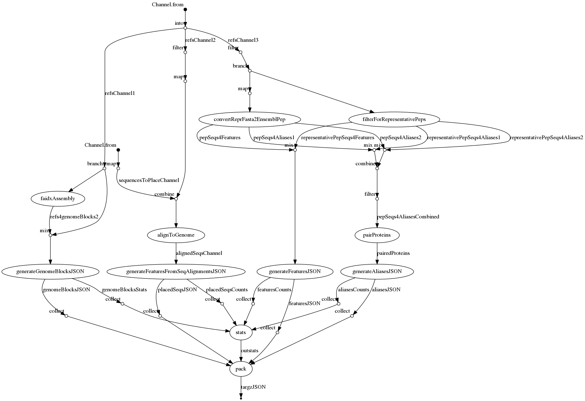

# pretzel-input-generator

This is a [nextflow](https://www.nextflow.io) pipeline for generating input for [pretzel](https://github.com/plantinformatics/pretzel) from annotated and (mostly) contiguous genome assemblies.


## Quick start

Requires [nextflow](https://www.nextflow.io) and [Singularity](http://singularity.lbl.gov)

```
nextflow run plantinformatics/pretzel-input-generator \
-revision v0.7 \
-profile singularity --localAssembly NA 
```

This will pull and process datasets from [Ensembl plants](https://plants.ensembl.org) specified in [`conf/input.config`](conf/input.config#L17-L39)


## Input

Input files are specified in [conf/input.config](conf/input.config). This can be supplemented/replaced by JSON/YAML formatted input spec.

### Data sources

Currently all input data comes from the following sources:

* [Ensembl plants](https://plants.ensembl.org) - multiple datasets as specified in [`conf/input.config`](conf/input.config#L17-L39)
* [International Wheat Genome Sequencing Consortium](https://www.wheatgenome.org/)
  * [Triticum aestivum (Chinese Spring) IWGSC RefSeq v1.0 assembly](https://wheat-urgi.versailles.inra.fr/Seq-Repository/Assemblies)
* [The wild emmer wheat sequencing consortium (WEWseq)](http://wewseq.wixsite.com/consortium)
  * Zavitan assembly downloaded from [GrainGenes](https://wheat.pw.usda.gov/GG3/wildemmer)
* [European Nucleotide Archive](https://www.ebi.ac.uk/ena)
  * [Assembly of chromosome 2D of *Triticum aestivum* line CH Campala *Lr22a*](https://www.ebi.ac.uk/ena/data/view/LS480641)
  * [Assembly of *Triticum urartu* ](https://www.ebi.ac.uk/ena/data/view/GCA_003073215)
    * Annotation downloaded from [MBKBase](http://www.mbkbase.org/Tu/)
  * [Assembly of *Aegilops tauschii* ](https://www.ebi.ac.uk/ena/data/view/GCA_002575655.1)
    * Annotation downloaded from [http://aegilops.wheat.ucdavis.edu/ATGSP/annotation/](http://aegilops.wheat.ucdavis.edu/ATGSP/annotation/)

### Remote

The pipeline pulls data from [Ensembl plants](https://plants.ensembl.org), included species and assembly versions are specified in [conf/input.config](conf/input.config).
For each of the datsets the pipeline downloads:

* genome assembly index file
* protein sequences

### Local

The pipeline requires

* a genome assembly index file - all we need are lengths of pseudo-chromosomes so a two-column `.tsv` file with chromosome names and their lengths will suffice
* gene annotations (either GTF or GFF3)
* matching protein sequences (presumably for representative isoform)

If GTF/GFF3 is not available, the protein sequences FASTA id and description lines must be formatted to contain information as per the following example:

```
>AT1G24405.1 pep chromosome:TAIR10:1:8654945:8655662:1 gene:AT1G24405
```

This follows how protein sequences are annotated on Ensembl plants, but we do not **currently** use all the information in the description line, the complete version of which is:

```
>AT1G24405.1 pep chromosome:TAIR10:1:8654945:8655662:1 gene:AT1G24405 transcript:AT1G24405.1 gene_biotype:protein_coding transcript_biotype:protein_coding description:F21J9.7 [Source:UniProtKB/TrEMBL;Acc:Q9FYM2]
```

To run this pipeline without the local input files, use `--localAssembly NA` at execution or modify your local copy of [conf/input.config](conf/input.config)

Wherever possible the local assembly files are used as input for the pipeline in their original form - as downloaded from their respective sources. This is however not always possible due to inconsistencies in formatting and varying levels of adherence to standards and conventions. We try to capture additional steps needed to prepare these input data sets for the inclusion in this pipeline in [doc/format_local.md](doc/format_local.md).

## Dependencies

* [nextflow](https://www.nextflow.io)
* **Either** of the following:
  * [Singularity](http://singularity.lbl.gov)
  * [Docker](http://singularity.lbl.gov)
  * Required software installed (e.g. as module, in which case specify its name in [`conf/modules.config`](conf/modules.config)). In addition to standard linux tools, these include:
    * [FASTX-Toolkit](http://hannonlab.cshl.edu/fastx_toolkit/)
    * [MMSeqs2](https://github.com/soedinglab/mmseqs2)

When using Singularity or Docker, the required containers are specified in [`conf/containers.conf`](conf/containers.config)

## Execution

We provide several execution profiles, "locally" may mean a designated server or an interactive session on a cluster. By appending  e.g. `-revision v0.7` to your command you can specify a release tag to run a specific revision. When re-running the pipeline after errors or changes use `-resume` to ensure only the necessary processes are re-run.

Run locally with docker

```
nextflow run plantinformatics/pretzel-input-generator \
-profile docker --localAssembly NA
```

Run locally with singularity

```
nextflow run plantinformatics/pretzel-input-generator \
-profile singularity --localAssembly NA
```

Dispatch on a SLURM cluster with singularity

```
nextflow run plantinformatics/pretzel-input-generator \
-profile slurm,singularity,singularitymodule --localAssembly NA
```

Dispatch on a SLURM cluster with modules (defined in [conf/modules.config](conf/modules.config))

```
nextflow run plantinformatics/pretzel-input-generator \
-profile slurm,modules --localAssembly NA
```

## Output

All generated JSON files generated by the pipeline are output to `results/JSON`.

* For each of the input genome assemblies, these include:
  * `*_genome.json` - dataset (genome) definitions specifying outer coordinates of blocks (chromosomes)
  * `*_annotation.json` - specifications of coordinates of features (genes) within blocks
* In addition, for each (lexicographically ordered) pair of genome assemblies, the pipeline generates:
  * `*_aliases.json` which specify links between features between the two genomes.

The output files (hopefully) conform to the requirements of [pretzel data structure](https://github.com/plantinformatics/pretzel-data).


The `results/flowinfo` directory contains summaries of pipeline execution and `results/downloads` includes the files downloaded from Ensembl plants.

```
results
├── downloads
├── flowinfo
└── JSON
```

To upload the generated data to your instance of pretzel, follow [these instructions](doc/upload.md).


## Pipeline overview

The pipeline requires approximately 1 cpu-day, but as many processes can run independently, the real run-time is much shorter if suitable compute resources are available.

If `-with-dag dag.dot` is specified, nextflow outputs a DOT language representation of the pipeline, as presented below.


